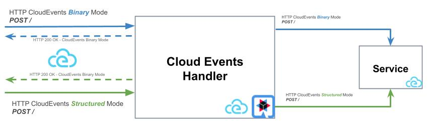

# CloudEvents Handler

## Késako ?

This is an application component that enables the consumption (limited to displaying) and production of CloudEvents, based on the **[HTTP Protocol Binding v1 spec][cloudevents-http-spec]**.



> ℹ️ By default, *cloudevents-handler* sends events in a vacuum (the ***Service*** is ignored). To specify a destination (*ready to receive CloudEvents in HTTP POST*), set the environment variable : `QUARKUS.REST_CLIENT_CLIENT_URL=<URL OF SERVICE>`

## Prerequisites

- [Task][taskfile-doc]
- [SDKMan][sdkman-doc]
- [Docker][docker-install-doc]

## Launch Application

Installing and configuring the correct version of the Java JDK :

```bash
sdk env install
```

```bash
task dev-mode

## Test Post CloudEvent in Structured Content Mode
task post-event/structured-mode

## Test Post CloudEvent in Binary Content Mode
task post-event/structured-mode
```

## Build Native and Container Image

### Native Image

```bash
## Build Native Image
task build-app/native

## Run it
target/target/cloudevents-handler-unused-runner
```

### Container Image

We use Java's own source-to-image tool : ***JIB***

```bash
## Build Container Image
task build-app/container

## Run Container Image
docker run -i --rm -p 8080:8080 ghcr.io/nzuguem/cloudevents-handler
```

## Resources

- [CloudEvents Hands-On][cloudevents-hands-on]
- [CloudEvents Player By Ruben Romero Montes][cloudevents-player-by-ruromero]
- [CloudEvents SDK Java][cloudevents-sdk-java-doc]
- [Example SDK CloudEvents SDK Quarkus][example-sdk-cloudevents-quarkus]

<!-- Links -->
[cloudevents-hands-on]: https://b-nova.com/en/home/content/cncf-graduates-cloudevents-a-game-changer-for-cross-platform-event-data/
[cloudevents-player-by-ruromero]: https://github.com/ruromero/cloudevents-player
[example-sdk-cloudevents-quarkus]: https://github.com/cloudevents/sdk-java/tree/main/examples/restful-ws-quarkus
[cloudevents-sdk-java-doc]: https://cloudevents.github.io/sdk-java/
[cloudevents-http-spec]: https://github.com/cloudevents/spec/blob/v1.0/http-protocol-binding.md
[taskfile-doc]: https://taskfile.dev/
[sdkman-doc]: https://sdkman.io/
[docker-install-doc]: https://docs.docker.com/engine/install/